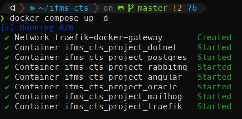
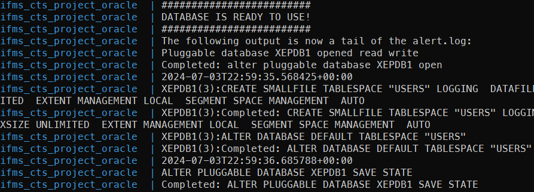
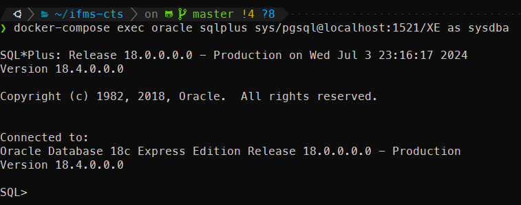
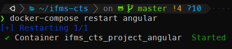
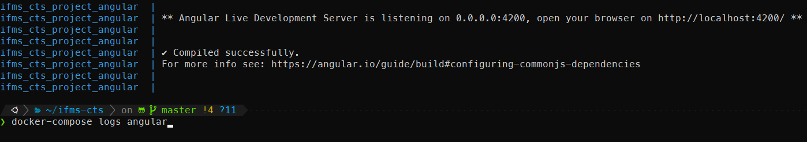
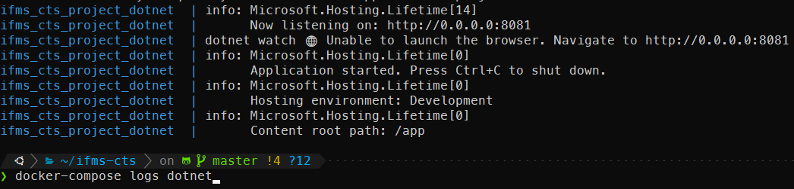
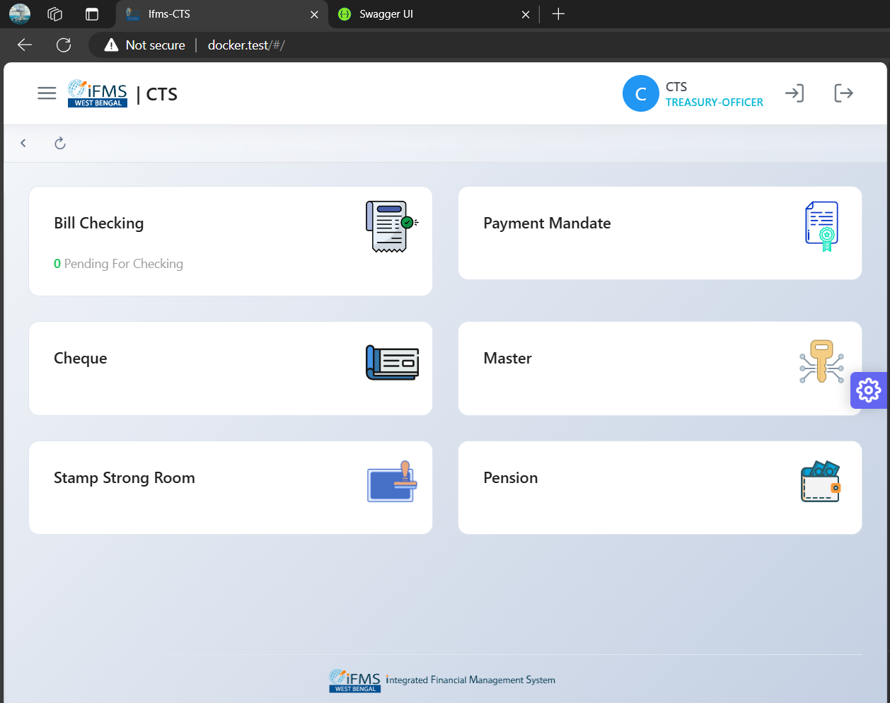
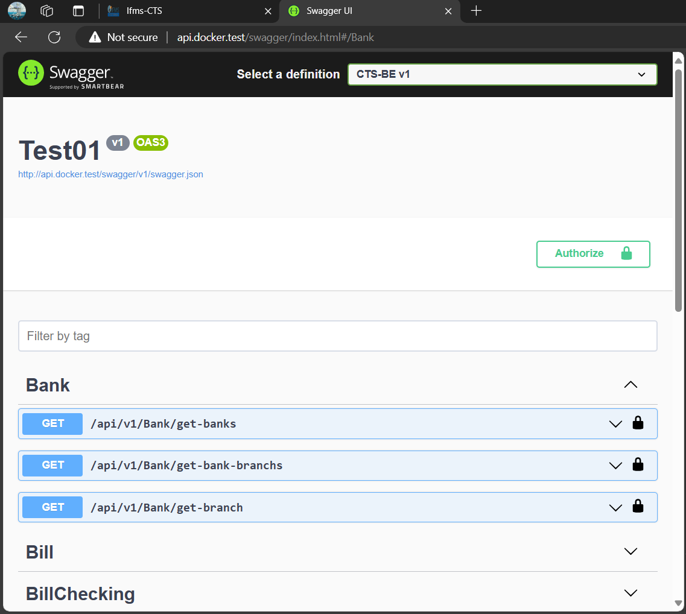
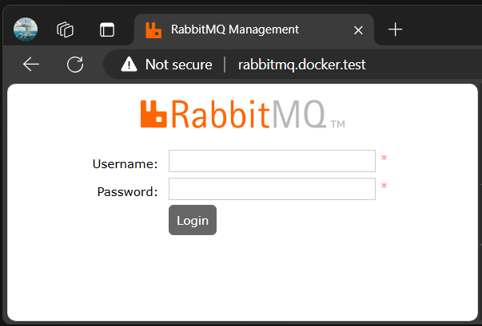

## Setup the code repository

#### Prerequisites:
- You need access to the [cts](https://www.wbgitlab.nic.in/ifms/cts.git) and [ctsapi](https://www.wbgitlab.nic.in/ifms/ctsapi.git) repositories on https://www.wbgitlab.nic.in

Run the following commands to clone the whole repository

```sh
git clone https://github.com/abusalam/IFMS-CTS.git ifms-cts
cd ifms-cts
git submodule init
git submodule update
```
### Setup Oracle database

Run the following commands

```sh
cp .env .env.docker
mkdir oracle-home/data
sudo chown 54321:54321 oracle-home/data
```

### Start docker-compose

```sh
docker-compose up -d
```


Initially when you are setting up for the first time it may take a little longer time as oracle initializes it's database

You can check the progress of oracle database initialization by running the following command

```sh
docker-compose logs oracle
```
Output will look some thing like this when initialization is completed


After the first run it will just take a couple of seconds to start everything

### Login to Orcale using SqlPlus as dba

```sh
docker-compose exec oracle sqlplus sys/pgsql@localhost:1521/XE as sysdba
```


If you want to modify the database run the following query to switch from CDB(Container Database) to PDB(Pluggable Database)

```sql
alter session set container = XEPDB1;
```
Then you can run your CREATE, INSERT, UPDATE, DELETE queries after switching

During development you may need to restart the angular or dotnet servers if you make changes to the code that can't be hot reloaded.

Run the following command to restart the respective docker container
```sh
docker-compose restart angular
docker-compose restart dotnet
```


Also you can check the status by running the following command

```sh
docker-compose logs angular
docker-compose logs dotnet
```



Apply patch for environment settings to your codebase

```sh
cd angular
git apply ../ng-env.patch
cd ../dotnet
git apply ../dotnet-env.patch
```

Make host entry: add the following line to your `%WINDIR%\System32\drivers\etc\hosts` file

```
127.0.0.1	docker.test api.docker.test rabbitmq.docker.test mailhog.docker.test
```
Open Angular UI http://docker.test/#/static-login



Open Dotnet Swagger UI http://api.docker.test/swagger/index.html



RabbitMQ Management UI http://rabbitmq.docker.test 

- Default Login: `guest/guest`



### Don't forget to restore postgresql database backup using pgAdmin
```env
DB_HOST=localhost
DB_USER=docker
DB_PASSWORD=docker@1234
DB_NAME=docker
DB_PORT=5432
```
Enjoy!